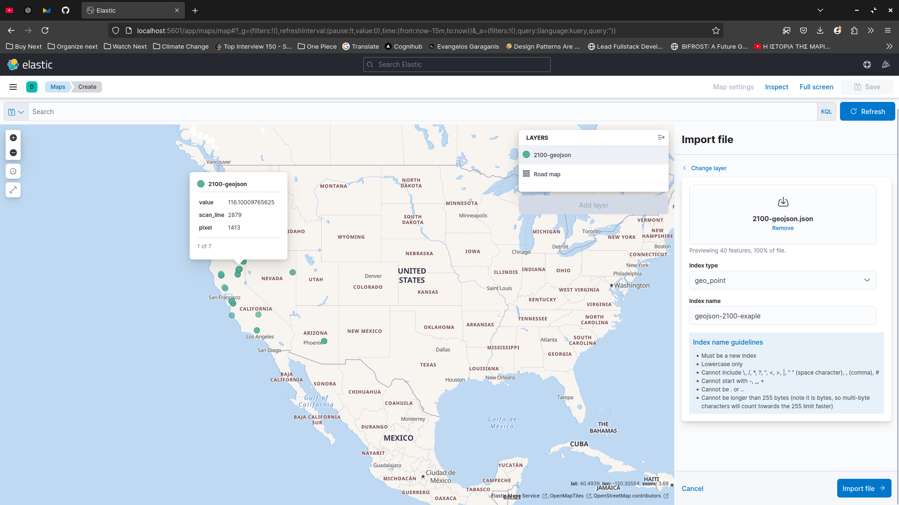
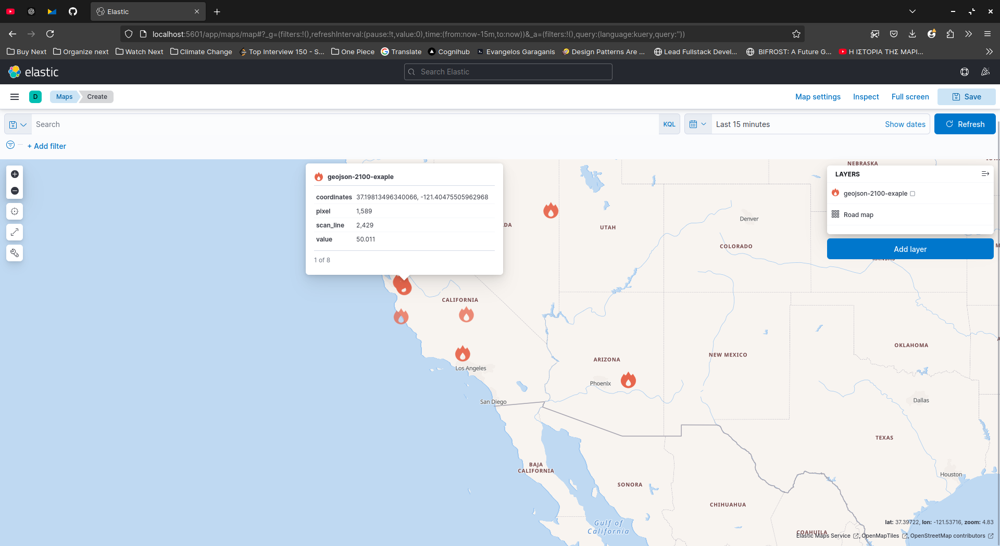
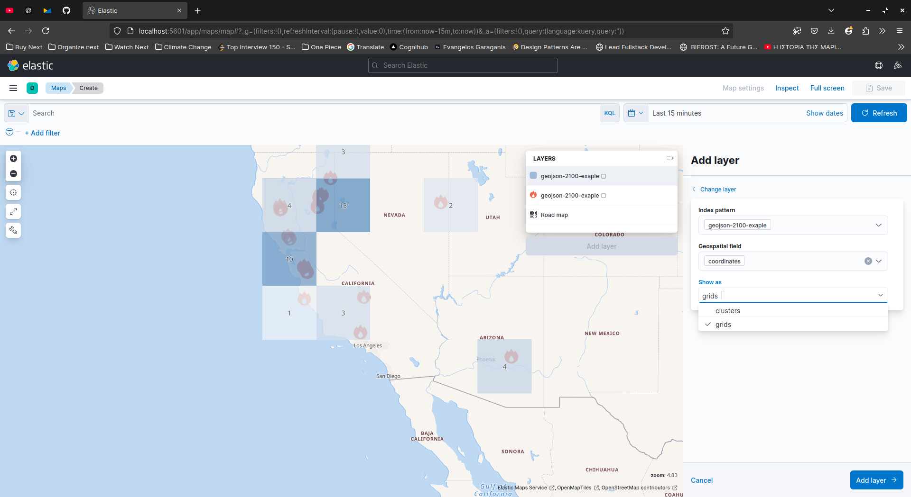
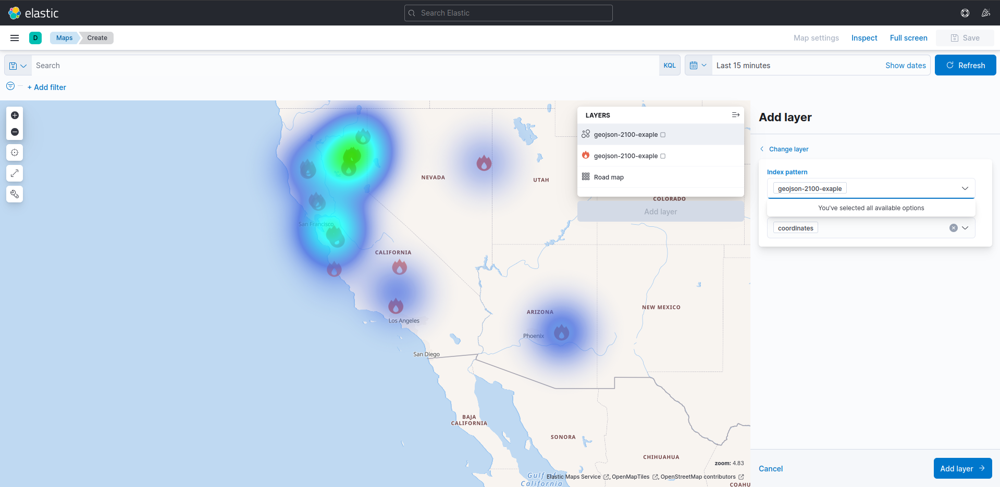

# OroraTech Assignment

## About

This is my submission for OroraTech's assement: Rudimentary fire detection algorithm for the VIIRS sensor onboard Suomi-NPP satellite.

Based on the [analysis](./analysis/assignment.md) conducted, and is documented under the `analysis` folder, I derived through possible thresholds:

- A dynamic threshold calculated in each overpass that tries to find and filter candidate hotpixels based on the max radiance value recorded in the specific overpass.
- A fixed threshold that was derived by analyzing data and by applying Planck's equation to get the approx. Celcius.

The though process can be found under [here](./analysis/thermal-anomalies-detection.md). Both of these thresholds are a first naive approach, in order to deliver the first POC that would integrate and implement the surrounding infrastructure, such us the python service and the geojson creation.

Given then you have up and running the server, you can upload the first input data in `localhost:8000`:


There's a basic error handling, to ensure that the NetCDF files are those of the same overpass. The service responds to requests under `/detect_thermal_anomalies` and will provided two geojsons, in the format:

```json
{
    "points": <GeoJSON>,
    "convex": <GeoJSON>
}
```

The points value contains the potential hotpixel candidates as GeoPoints, while the convex, contains the Polygons of the hotpixel cluster's derived. The service apply's one of the two threshold proposed (currently the 25%), filters the hotpixel candidates, tries to find clusters and returns the geojsons.

### Next Steps & Debt

- Research bibliography, further investigation and apply and validate state-of-the-art algorithms regarding the domain of the problem
- Engineering-wise, the code is not so DRY, for the time being. There can be many wrappers and design patterns applied, to make the DX better. You know how it goes, though, premature optimization is the root of all evit! :)
- I tried to create a convex and concave using `scikit`, `geopandas`, `shapely` over my clusters but I didn't manage to deliver some quality results, so for the time being I let my kinda sketchy Polygons to stand out. Elastic created clusters and heatmaps for me, in the following section, though.

### Extra experimentation

I integrated Elasticsearch & Kibana in the infra, in order to perform some sort of Geospatial analysis over the retrieved GeoJSONs.

You can experiment with the tools, under `localhost:5601` for Kibana and `localhost:9200` for Elastic.

Experimentation with [example geojson ouput](./2100-geojson.json).









There is a lot of space to explore, here, too.

## Running

### Through terminal

From `code/src` folder

```sh
$ python -m venv .venv
$ source .venv/bin/activate
$ pip install -r requirements.txt
$ fastapi dev main.py
```

### Through container

From `code` folder

```sh
$ docker build -t myimage .
$ docker run -d --name mycontainer -p 8000:80 myimage
```

### Deploy whole infra

From `root` folder

```sh
$ docker-compose pull
$ docker-compose build
$ docker-compose up
```