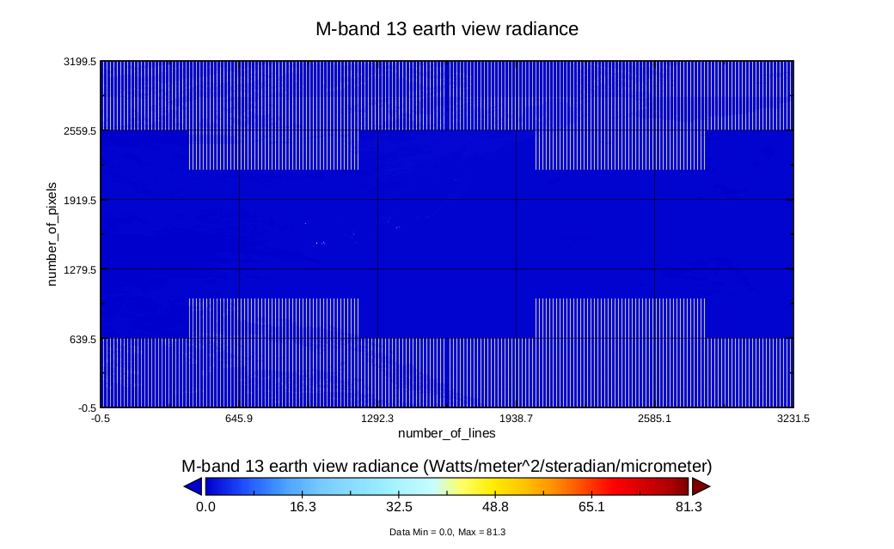
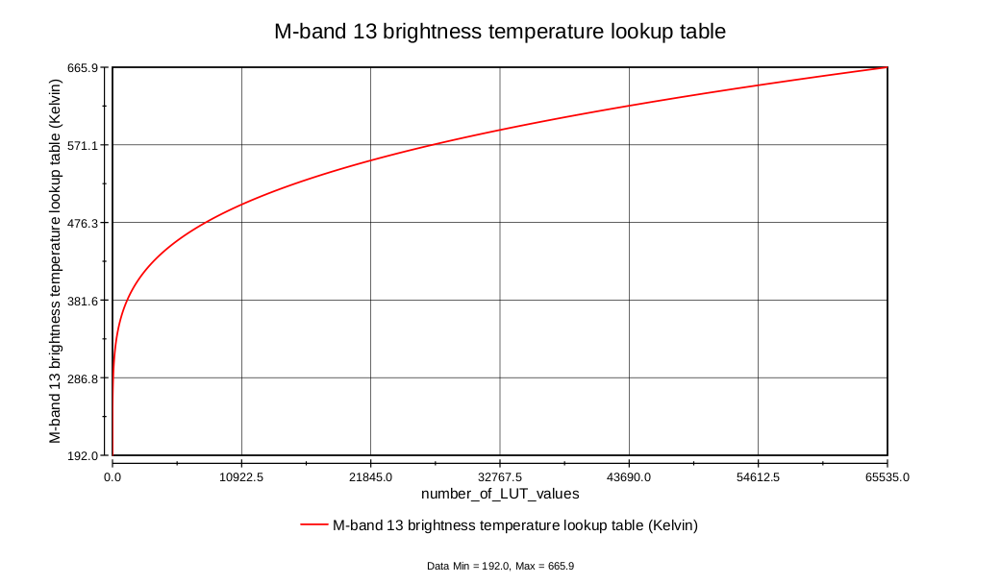

# Input: Satellite Data - VIIRS images

We have 4 sample satellite overpasses. Collected from California between 20/08/20 - 21/08/21. Starting with Google Drive's folder. 

Each overpass consists of two NetCDF files, that can be explored using [Panoply](https://www.giss.nasa.gov/tools/panoply/).

1. File starting with *VNP02* contains observation data (radiance recorded by the sensor)
2. File starting with *VNP03* contains geolocation data (the geographical coordinates of each pixel in the observation data file)

We have **4** such overpasses (8 files):

- 1000
- 2118
- 0942
- 2100

## Understanding input format

Case: 1000
Accessed with Polyglot

### VNP02MOD_NRT.A2020233.1000.001.nc

As a VNP02 file, this file contains the **radiance recorded by the sensor**.

1. Diagnostics (Single-Gain Bands Space View Diagnostics, ...)
2. Observation data (M07, M08, ...)
3. Scan line attributes (Start time, End time, Mid time, ...)

#### Understanding the M13 band

##### M13 Plot: Color contour X: number of line, Y: number of pixels

##### M13 Brightness Temperature LUT Plot: Number of LUT values for the X axis

-81.15°C to 392.75°C

### VNP03MOD_NRT.A2020233.1000.001.nc

As a VNP03 file, this file contains the **geographical coordinates of each pixel in the observation data file**.

1. Geolocation data (Latitudes of pixel locations, Longitudes of pixel locations, Terrain height at pixel locations, ...)
2. Navigation data (Attitude quaternions at EV mid-times (J2000 to spacecraft), Attitude angles (roll, pitch, yaw) at EV start-times, ...)
3. Scan line attributes (Start time, End time, Mid time, HAM side, ...)

