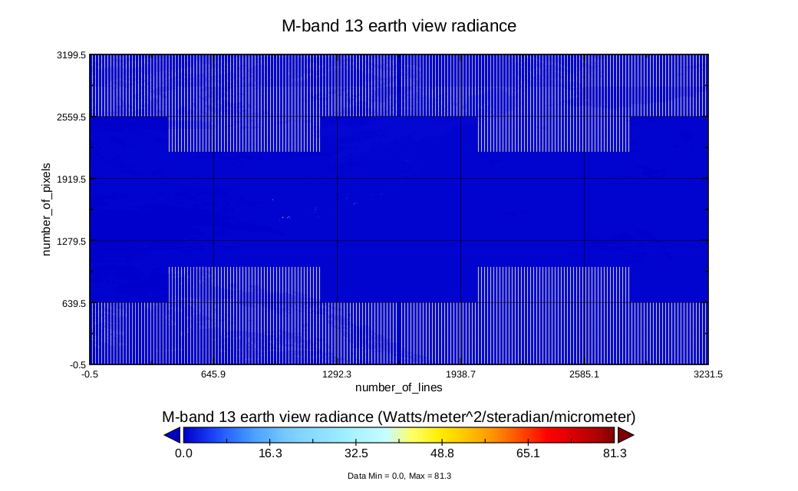
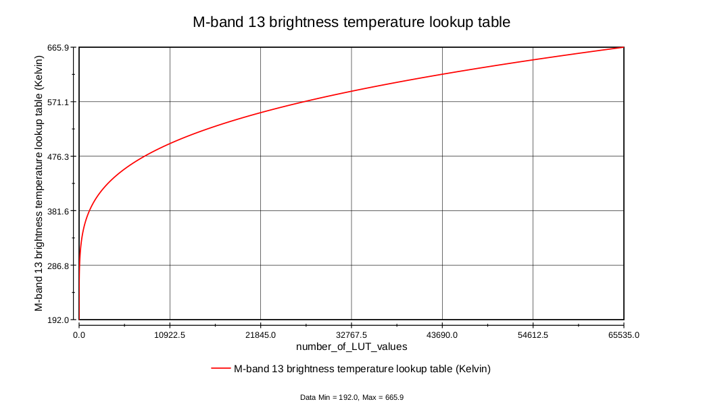
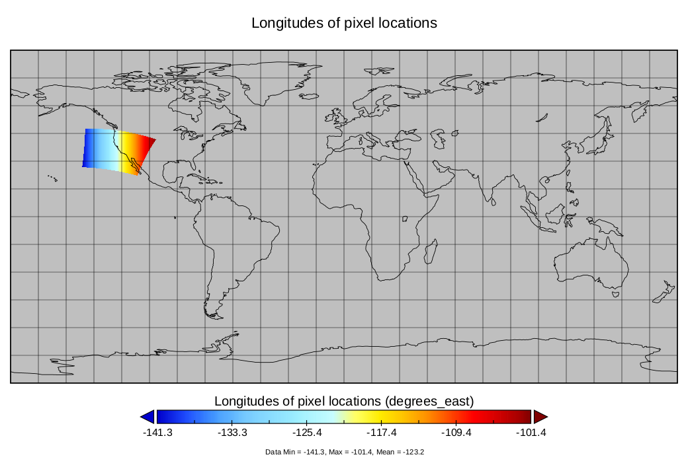
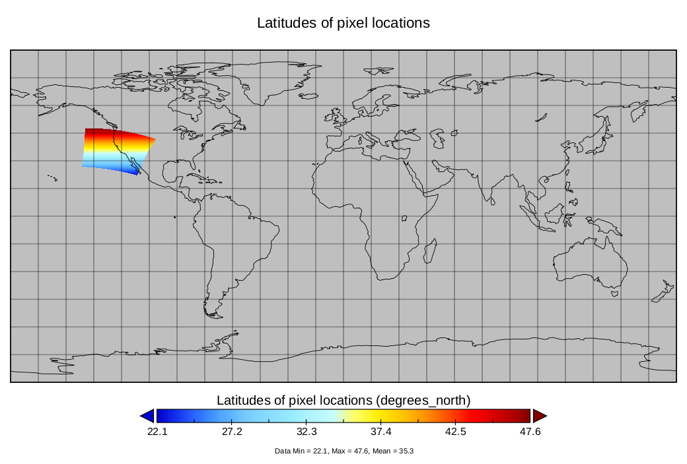
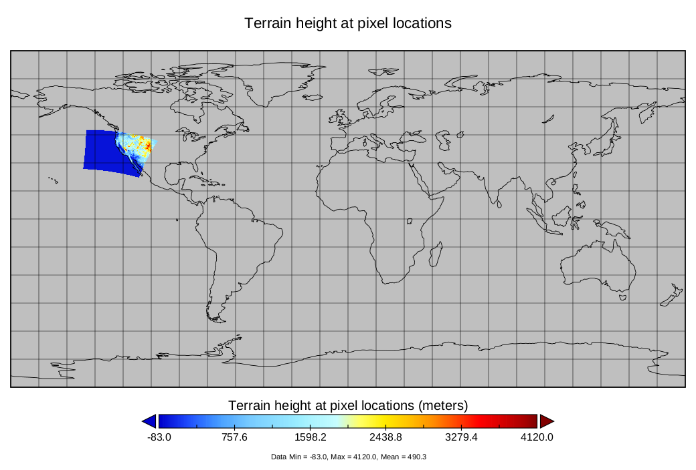

# Input: Satellite Data - VIIRS images

We have 4 sample satellite overpasses. Collected from California between 20/08/20 - 21/08/21. Starting with Google Drive's folder. 

Each overpass consists of two NetCDF files, that can be explored using [Panoply](https://www.giss.nasa.gov/tools/panoply/).

1. File starting with *VNP02* contains observation data (radiance recorded by the sensor)
2. File starting with *VNP03* contains geolocation data (the geographical coordinates of each pixel in the observation data file)

We have **4** such overpasses (8 files):

- 1000: 20/08/2020 10:00 - 10:06
- 2118: 20/08/2020 21:18 - 21:24
- 0942: 21/08/2020 9:42 - 9:48
- 2100: 21/08/2020 21:00 - 21:06

## Understanding input format

Case: 1000
Accessed with Polyglot

### VNP02MOD_NRT.A2020233.1000.001.nc

As a VNP02 file, this file contains the **radiance recorded by the sensor**.

1. Diagnostics (Single-Gain Bands Space View Diagnostics, ...)
2. Observation data (M07, M08, ...)
3. Scan line attributes (Start time, End time, Mid time, ...)

#### Observation Data: Understanding the M13 band

The M13_Quality_Flags indicate specific issues or conditions affecting the data (e.g. clouds, saturation, calibration errors), while the M13_Uncertainty_Index provides a numerical measure of confidence in the accuracy or reliability of the radiometric data.

##### M13 Plot: Color contour X: number of line, Y: number of pixels



##### M13 Brightness Temperature LUT Plot: Number of LUT values for the X axis



-81.15°C to 392.75°C

### VNP03MOD_NRT.A2020233.1000.001.nc

As a VNP03 file, this file contains the **geographical coordinates of each pixel in the observation data file**.

1. Geolocation data (Latitudes of pixel locations, Longitudes of pixel locations, Terrain height at pixel locations, ...)
2. Navigation data (Attitude quaternions at EV mid-times (J2000 to spacecraft), Attitude angles (roll, pitch, yaw) at EV start-times, ...)
3. Scan line attributes (Start time, End time, Mid time, HAM side, ...)

#### Geolocation data: Understanding the data





## Questions

### Pixel location / correlation with data

We have data based on pixel location, including:

- Brightness
- Longitude
- Latitute
- Height
- ... and more based NetCDF file and filter applied

In both NetCDF files, data of interest like the forementioned, have two
variables that are exactly the same on all cases, that being:

1. number_of_lines = 3232  
2. number_of_pixels = 3200

So, you can create the plots and have this uniform cartesian space:

```
Number of scan lines
     ^
3221 |
     |
     |
     |  X: Captured metric
     |
     |  
   0 |- - - - - - - - - - > Pixels
      0                 3199
```

#### Interpretations

##### About Grid and the Map plotting in Panoply

The dimensions of the latitude and longitude variables (3232 lines and 3200 pixels) correspond to the spatial grid of the data. Each point in the grid has a pair of latitude and longitude values, defining its geographic location.

So what Panoply essentially does, is:

1. Recognize which variables represent latitude and longitude.
2. Map the grid dimensions (number_of_lines and number_of_pixels) to the map.
3. Choose appropriate map projections and overlay options.

In simple words, the number of lines (rows) and number of pixels (columns) in the data define a Cartesian grid in the file, and the latitude and longitude arrays are used to geolocate this grid onto a map.